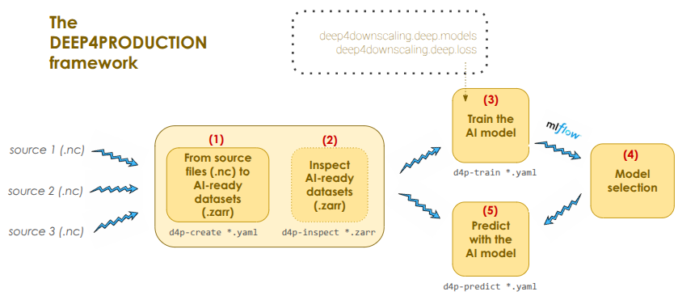

# deep4production

[](https://www.gnu.org/licenses/gpl-3.0)

## Description



`deep4production` is a command-line framework designed to streamline the **end-to-end workflow for deep learning–based climate downscaling in production environments**. It provides tools to transform raw climate datasets into AI-ready formats, train deep learning models, and perform inference in a reproducible and scalable way.

The framework relies on the **`deep4downscaling` library**, which provides the deep learning architectures and loss functions used during model training.

### Workflow Overview

The typical workflow consists of four main steps:

1. **Create AI-ready datasets (`d4p-create`)**

   Raw climate datasets (e.g., NetCDF `.nc` files) are converted into **AI-ready datasets stored in the Zarr format**.
   This step standardizes data structures, preprocessing, and chunking to enable efficient deep learning training.

   ```bash
   d4p-create config.yaml
   ```

2. **Inspect AI-ready datasets (`d4p-inspect`)**

   The generated Zarr datasets can be inspected to verify structure, metadata, variables, and chunking before training.

   ```bash
   d4p-inspect dataset.zarr
   ```

3. **Train a deep learning model (`d4p-train`)**

   Models from the `deep4downscaling` framework can be trained using the prepared datasets.
   Training configurations are defined through YAML configuration files.

   ```bash
   d4p-train train_config.yaml
   ```

   During training, experiments can be **tracked with MLflow**, allowing users to store:

   * model artifacts
   * training metrics
   * logs
   * configuration files

   This makes it possible to compare experiments and select the best-performing model.

4. **Run inference (`d4p-predict`)**

   Once a model is selected, predictions can be generated using the trained model and new input data.

   ```bash
   d4p-predict predict_config.yaml
   ```

Example YAML configuration files are available in the `recipes` directory and can be used as templates for your own configurations.

### Model Selection and Experiment Tracking

`deep4production` integrates with **MLflow** for experiment tracking and model management. By synchronizing training artifacts and logs with MLflow, users can:

* compare different training runs
* inspect metrics and performance
* select the best-performing model
* manage model versions

This enables a **reproducible and production-ready machine learning workflow**.

### Supported Data Formats

* **Input data:** NetCDF (`.nc`)
* **AI-ready datasets:** Zarr (`.zarr`)

Zarr datasets allow efficient **parallel I/O and chunked storage**, which is well suited for large climate datasets and distributed training.

### Command-Line Interface

The framework provides four main console commands:

| Command       | Purpose                                             |
| ------------- | --------------------------------------------------- |
| `d4p-create`  | Convert raw NetCDF datasets to AI-ready Zarr format |
| `d4p-inspect` | Inspect generated AI-ready datasets                 |
| `d4p-train`   | Train deep learning models                          |
| `d4p-predict` | Generate predictions using trained models           |

Together, these commands implement a **complete pipeline for preparing data, training models, and deploying predictions in operational workflows**.


## Table of Contents

- [Installation](#installation)
- [Usage](#usage)
- [Documentation](#documentation)
- [Contributing](#contributing)

## Installation

### 1. Clone the Repository
```bash
git clone https://github.com/SantanderMetGroup/deep4production/
cd deep4production
```

### 2. Create a Python environment
It is recommended to install the library inside a clean environment (e.g., `conda` or `venv`) . 

Example using conda:
```bash
conda create -n deep4production python=3.15
conda activate deep4production
```

### 3. Install dependencies (Optional but recommended)
A stable set of library versions is provided in `requirements.txt`. To reproduce the tested environment, install them with:
```bash
pip install -r requirements.txt
```

### 4. Install the library
Install the package from the repository:
```bash
pip install .
```
For development purposes, install the library in editable mode so that changes in the source code are immediately reflected:
```bash
pip install -e .
```

### 5. Install `deep4downscaling` (Not implemented yet: Skip this step)
`deep4production` relies on the `deep4downscaling` framework, which provides code for established deep learning downscaling models and loss functions.
```bash
pip install git+https://github.com/SantanderMetGroup/deep4downscaling.git
```   

### 6. Enable GPU support (Optional)

If you plan to run deep learning models on GPUs, install the CUDA-enabled version of PyTorch. For example for CUDA 11.8
```bash
pip install torch==2.7.1+cu118 torchvision==0.22.1+cu118 torchaudio==2.7.1+cu118 --index-url https://download.pytorch.org/whl/cu118
```  
You can verify that PyTorch detects the GPU with:
```bash
python
import torch
print(torch.cuda.is_available())
```  


## Usage

We provide a set of Jupyter notebooks in the `notebooks` directory that demonstrate the basic functionality of the `deep4production` library. These notebooks cover topics such as:

- Production of AI-ready datasets in Zarr format 
- Model training and integration with Mlflow
- Model inference
- Data visualization

As new features are developed and added to `deep4production`, additional example notebooks will be included to help you stay up-to-date with the latest capabilities.

## Documentation

While `deep4production` does not currently offer a formal documentation website, all library functions include comprehensive `docstrings` describing their purpose, parameters, and return values. This ensures that the code is self-explanatory for developers who want to use or extend the library.

For further guidance on how to use `deep4production`, please refer to:
- The notebooks in `notebooks`, which provide example workflows.  
- The `docstrings` in the source code, which offer detailed explanations of functions and classes.  

Should you have any questions or need clarifications, feel free to open an issue or contribute to improving the documentation.

## Contributing

We use two main branches:

- `main`: stable, release-ready code (default branch when cloning).
- `devel`: active development / integration branch.

All pull requests must target `devel`. Direct pushes to `main` and `devel` are restricted to the maintainers. Maintainers periodically merge `devel` into `main` and create new tagged releases from `main`.

---

### For collaborators (with write access)

1. Clone the repository:

   ```bash
   git clone https://github.com/SantanderMetGroup/deep4production.git
   cd deep4production
   ```

2. Create a `feature`/`fix` branch from `devel`:

   ```bash
   git checkout devel
   git pull origin devel
   git checkout -b feature/my-change
   ```

3. Work and keep in sync with `devel` (optional but recommended):

   ```bash
   git checkout devel
   git pull origin devel
   git checkout feature/my-change
   git merge devel
   ```

4. Push and open a pull request into `devel`:

   ```bash
   git push -u origin feature/my-change
   ```

On GitHub, open a PR with base branch `devel` (not `main`).

### For external contributors (no write access)

1. Fork this repository on GitHub to your own account.
2. Clone your fork:

   ```bash
   git clone https://github.com/<your-username>/deep4production.git
   cd deep4production
   ```

3. Add the original repo as upstream and fetch:

   ```bash
   git remote add upstream https://github.com/SantanderMetGroup/deep4production.git
   git fetch upstream
   ```

4. Create a `feature`/`fix` branch from `upstream/devel`:

   ```bash
   git checkout -b feature/my-change upstream/devel
   ```

5. Commit your changes and push to your fork:

   ```bash
   git add ...
   git commit -m "Describe your change"
   git push -u origin feature/my-change
   ```

6. Open a pull request to this repository:

   - base repository: `SantanderMetGroup/deep4production`
   - base branch: `devel`
   - head repository: `<your-username>/deep4production`
   - compare branch: `feature/my-change`