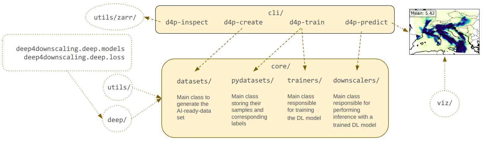

## Package Structure

This section provides an overview of the internal structure of the `deep4production` Python package to help contributors quickly understand where to place new code and how components interact.

### Overview

The package is organized into four main layers:

- **CLI layer (`cli/`)** → User-facing commands  
- **Core layer (`core/`)** → Main application logic  
- **Utilities & deep learning modules (`utils/`, `deep/`)** → Supporting functionality and models  
- **Visualization (`viz/`)** → code for visualize the predicted meteorological fields.

This modular design separates responsibilities, making the codebase easier to maintain and extend.

---

### CLI Layer (`cli/`)

The `cli/` module provides entry points for interacting with the library from the command line:

- `d4p-create` → Prepare AI ready datasets
- `d4p-inspect` → Inspect AI ready datasets
- `d4p-train` → Train deep learning models  
- `d4p-predict` → Run inference using trained models  

These commands orchestrate workflows and call into the `core/` modules.

---

### Core Layer (`core/`)

The `core/` directory contains the main building blocks:

#### `datasets/`
- Generates AI-ready datasets  
- Handles preprocessing and formatting  

#### `pydatasets/`
- Stores samples and corresponding labels  
- Provides standardized dataset interfaces  

#### `trainers/`
- Implements training pipelines  
- Handles optimization and training loops  

#### `downscalers/`
- Performs inference using trained models  
- Produces predictions with appropriate metadata 

---

### Deep Learning Modules (`deep/`)

- Includes functions for training, postprocessors, schedulers and utilities.

---

### Utilities (`utils/`)

- General helper functions  

---

### Visualization (`viz/`)

- Utilities for visualizing outputs (e.g., prediction maps)

---