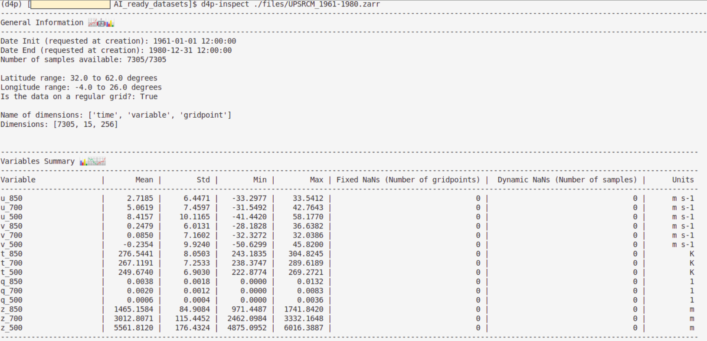
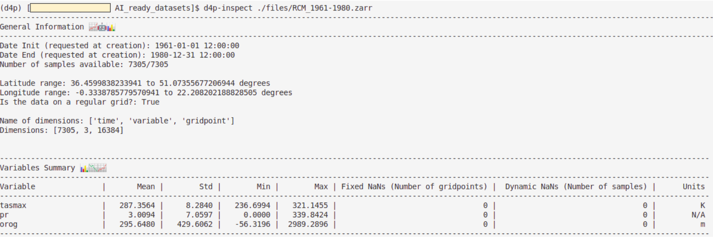
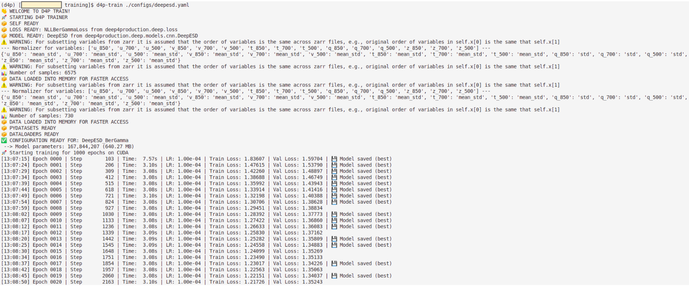
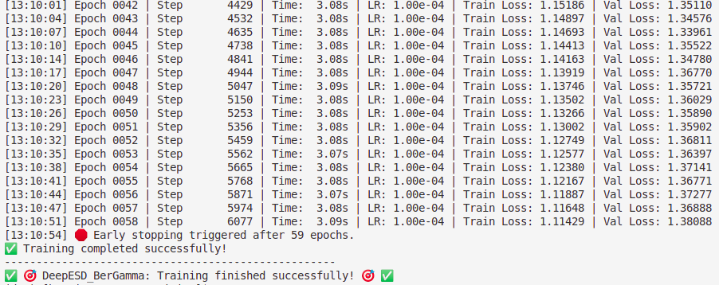
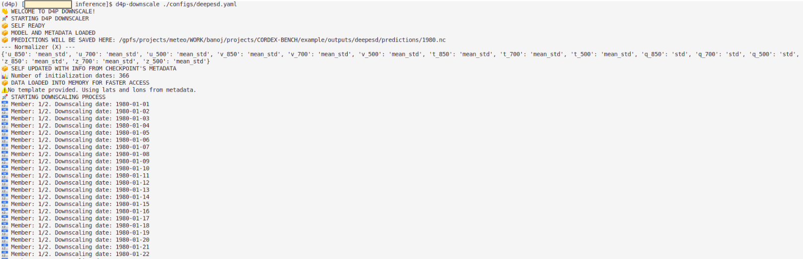
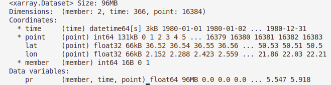
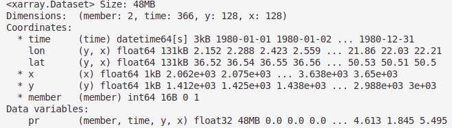
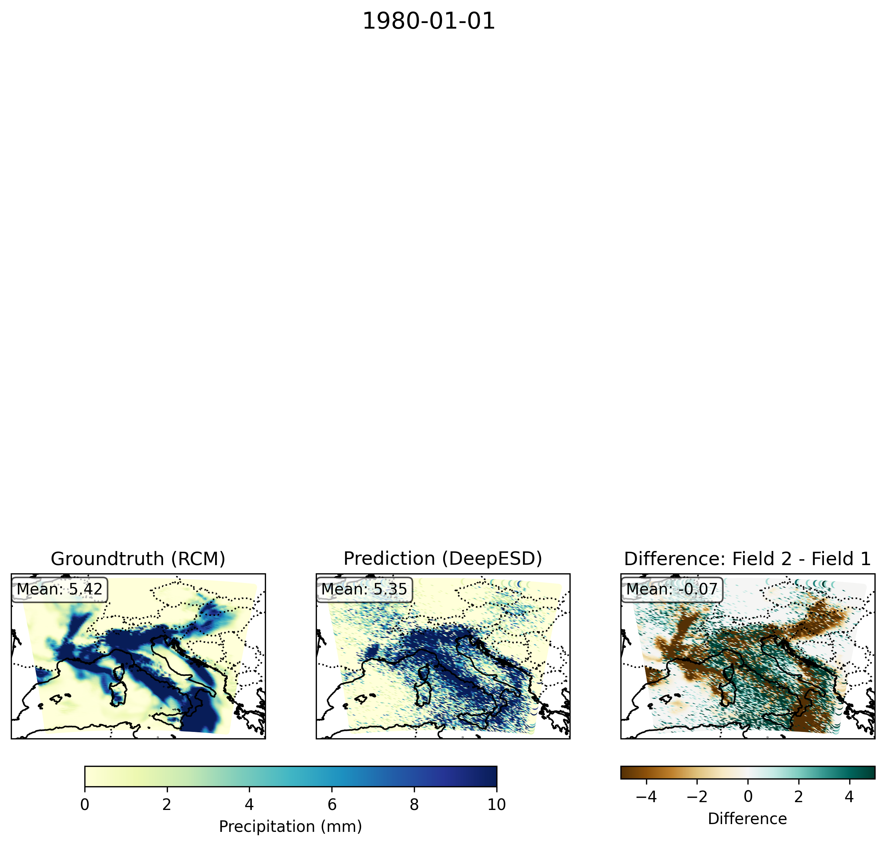

# Deep4Production Tutorial: CORDEX-BENCH Alps Case Study with DeepESD

This tutorial demonstrates how to use the [deep4production](https://github.com/yourorg/deep4production) framework for climate downscaling, using the CORDEX-BENCH Alps domain as a case study. We will walk through the full workflow: preparing AI-ready datasets, inspecting datasets, training a model, and running inference.

---

## 1. Introduction

### Command Line Interface (CLI) available in `deep4production`

**deep4production** is a modular command-line framework designed to operationalize deep learning workflows for climate downscaling applications. It operates with four main tools:

1. `d4p-create`: Converts NetCDF source files into AI-ready Zarr datasets containing precomputed statistics.
2. `d4p-inspect`: Inspects the created Zarr file for basic QA/QC.
3. `d4p-train`: Trains a deep learning downscaling model.
4. `d4p-predict`: Runs inference using trained model.

All steps are controlled via **YAML configuration files**, ensuring:

* **Reproducibility**

* **Transparency**

* **Easy experimentation**

Please see installation instructions at: 
https://github.com/SantanderMetGroup/deep4production/tree/master


### Project structure

The `deep4production` workflow relies on a well-defined directory structure to organize data, configurations, models, and outputs. Each step of the pipeline (dataset creation, training, inference) reads from and writes to specific locations.

A typical project structure looks like:

```
example/
├── AI_ready_datasets/
│ ├── configs/ # YAML configs for dataset creation
│ │ ├── config_predictor.yaml # e.g., UPSRCM_1961-1980.yaml
│ │ └── config_predictand.yaml # e.g., RCM_1961-1980.yaml
│ └── files/ # Generated Zarr datasets
│ ├── UPSRCM_1961-1980.zarr # Created with: d4p-create /example/AI_ready_datasets/configs/UPSRCM_1961-1980.yaml
│ └── RCM_1961-1980.zarr # Created with: d4p-create /example/AI_ready_datasets/configs/RCM_1961-1980.yaml
│
├── source_files/ # Raw downloaded data storing the netcdf files.
│ └── data_zenodo/
│
├── training/
│ ├── configs/ # Training configuration files. There could be as many YAML configs as models you would like to test.
│ │ └── deepesd.yaml # Use d4p-train your_yaml.yaml to train the model
│ └── logs/ # Training logs
│
├── inference/
│ ├── configs/ # Inference configuration files. There could be as many YAML configs as models you would like to test.
│ │ └── deepesd.yaml # Use d4p-predict your_yaml.yaml to perform inference
│ └── logs/ # Inference logs
│
├── outputs/ # Automatically generated at training.
│ └── deepesd/ # Outputs for a given run_ID
│   ├── models/ # Trained models (.pt files)
│   ├── predictions/ # Model predictions (.nc files)
    └── aux_files/ # Additional metadata or artifacts
│
├── templates/ # Optional templates for output formatting
│ └── pr_template.nc
│
└── *.sh # Bash scripts calling the deep4production CLI commands.
```

The following directories have to be created manually: 
* `/example/AI_ready_datasets/` 
* `/example/AI_ready_datasets/configs/`
* `/example/AI_ready_datasets/files/`
* `/example/source_files/`
* `/example/training/`
* `/example/training/configs/`
* `/example/training/logs/`
* `/example/inference/`
* `/example/inference/configs/`
* `/example/inference/logs/`
* `/example/templates`

For this tutorial, commands and scripts are run from `./example`, so all paths are relative to that directory.

---

## 2. Case study: CORDEX-BENCH

**CORDEX-BENCH** is a community benchmark dataset from **CORDEX (Coordinated Regional Climate Downscaling Experiment)**, designed to evaluate machine learning methods for climate downscaling in a standardized and reproducible way. It defines standardized training and test experiments assessing various downscaling challenges along with the corresponding datasets from Regional Climate Models (RCMs) driven by different Global Climate Models (GCMs), across different regions covering both the standard (perfect prognosis ESD) and emulation climate downscaling approaches.

For more details on CORDEX-BENCH, see the official repository:  
https://github.com/WCRP-CORDEX/ml-benchmark

To keep the focus on illustrating the workflow of `deep4production`, we use a **simplified CORDEX-BENCH configuration**.

* **Domain:** Central Europe (Alps)
* **AI-model backbone:** DeepESD 
* **Loss function:** Negative log-likelihood of a Bernoulli-Gamma

Information from predictors, predictands and forcings sources is explained below:
* **Predictors:**
  * **Dataset**: Upscaled CNRM-CM5-ALADIN-63 Regional Climate Model
  * **Spatial resolution (dimensions)**: 2-degrees (16 x 16)
  * **Temporal resolution**: daily
  * **Variables:** 15
    * `z_850`, `z_700`, `z_500`: geopotential at 850, 700, and 500 hPa
    * `t_850`, `t_700`, `t_500`: air temperature at 850, 700, and 500 hPa
    * `q_850`, `q_700`, `q_500`: specific humidity at 700, 700, and 500 hPa
    * `u_850`, `u_700`, `u_500`: zonal wind at 500, 700, and 500 hPa
    * `v_850`, `v_700`, `v_500`: meridional wind at 850, 700, and 500 hPa
* **Predictands:** 
  * **Dataset**: CNRM-CM5-ALADIN-63 Regional Climate Model
  * **Spatial resolution (dimensions)**: 0.11-degrees (128 x 128)
  * **Temporal resolution**: daily
  * **Variables:** 1
    * `pr`: precipitation
* **Forcings:** 
  * **Dataset**: CNRM-CM5-ALADIN-63 Regional Climate Model
  * **Spatial resolution (dimensions)**: 0.11-degrees (128 x 128)
  * **Temporal resolution**: daily
  * **Variables:** 1
    * `orog`: orography

The following training, validation and testing periods are considered:
* **Training period**: 1961-1979 (except 1967, 1975)
* **Validation period**: 1967, 1975
* **Testing period**: 1980

For simplicity, the CNRM-CM5-ALADIN-63 Regional Climate Model and its upscaled version will hereafter be referred to as **RCM** and **UPSRCM**, respectively.

---

## 3. Download CORDEX-BENCH Alps Data

We download the data from CORDEX-BENCH Zenodo and place it in `/example/source_files/data_zenodo/`. Estimated size of files is: 4 GB.

```python
import os
import zipfile
import shutil

os.makedirs("./source_files/data_zenodo/", exist_ok=True)

##################################
###### This line is on bash ######
!wget -P ./data_zenodo/ https://zenodo.org/records/15797226/files/ALPS_domain.zip?download=1
##################################

shutil.move("./source_files/data_zenodo/ALPS_domain.zip?download=1", "./data_zenodo/ALPS_domain.zip")

with zipfile.ZipFile('./data_zenodo/ALPS_domain.zip', 'r') as zip_ref:
        zip_ref.extractall('./data_zenodo/')
    
os.remove("./source_files/data_zenodo/ALPS_domain.zip")
```

---

## 4. Prepare AI-Ready Datasets with `d4p-create`

We use YAML configuration files to convert raw NetCDF data into **AI-ready Zarr datasets** using `d4p-create`. This step is essential because it standardizes the data format, extracts only the required variables, and computes normalization statistics that will be reused during training.

Each YAML file fully defines how the dataset is built, including:
- The **time period** to extract (`date_init`, `date_end`, `freq`)
- The **input NetCDF files** (`data.paths`)
- The **variables** to include (`data.vars`)
- The **output location** (`output_path`)
- Whether to **overwrite** existing datasets

Importantly, the configuration can accept **multiple NetCDF files**, which is useful when variables are stored in different files.

During execution, `d4p-create` will:
1. Load the specified NetCDF files  
2. Select and align variables across files  
3. Subset the requested time range  
4. Compute summary statistics (e.g., mean, standard deviation)  
5. Store everything in a **Zarr dataset optimized for deep learning workflows**  

Example configuration files are available in `./AI_ready_datasets/configs/`.
```python
# Show example YAML config for UPSRCM (predictor)
date_init: 1961-01-01 12:00:00
date_end: 1980-12-31 12:00:00
freq: 1D

data:
  paths: [./source_files/data_zenodo/ALPS_domain/train/ESD_pseudo_reality/predictors/CNRM-CM5_1961-1980.nc]
  vars: [u_850, u_700, u_500, v_850, v_700, v_500, t_850, t_700, t_500, q_850, q_700, q_500, z_850, z_700, z_500]

output_path: ./AI_ready_datasets/files/UPSRCM_1961-1980.zarr
overwrite: True
```

```python
# Show example YAML config for RCM (predictand)
date_init: 1961-01-01 12:00:00
date_end: 1980-12-31 12:00:00
freq: 1D

data:
  paths: [./source_files/data_zenodo/ALPS_domain/train/ESD_pseudo_reality/target/pr_tasmax_CNRM-CM5_1961-1980.nc,
          ./source_files/data_zenodo/ALPS_domain/train/ESD_pseudo_reality/predictors/Static_fields.nc]
  vars: [tasmax, pr, orog]

output_path: ./AI_ready_datasets/files/RCM_1961-1980.zarr
overwrite: True
```

Once the configuration files are defined, we generate the AI-ready-datasets using: `d4p-create`. Each command reads the corresponding YAML file and executes the full preprocessing pipeline automatically, producing ready-to-use `.zarr` datasets for training and inference.

```bash
d4p-create ./AI_ready_datasets/configs/UPSRCM_1961-1980.yaml # Predictors
d4p-create ./AI_ready_datasets/configs/RCM_1961-1980.yaml # Predictands and forcings
```

---

## 5. Inspect the Zarr Datasets with `d4p-inspect`

Once the AI-ready datasets have been created, it is good practice to inspect them to ensure everything has been processed correctly.

The `d4p-inspect` command provides a quick summary of the dataset, including:
- Available variables  
- Spatial and temporal dimensions  
- Data shapes (useful for model configuration)  
- Stored normalization statistics  
- Missing values

This step is particularly important to:
- Verify that all expected variables are present  
- Check that predictor and predictand dimensions are consistent  
- Check that predictor and predictand min, max values are consistent.
- Check whether there are missing values in the datasets that´d need to be replaced.

```bash
d4p-inspect ./AI_ready_datasets/files/UPSRCM_1961-1980.zarr # Predictors
d4p-inspect ./AI_ready_datasets/files/RCM_1961-1980.zarr # Predictands 
```

The output should look like this for the predictors:


... and like this for the predictands:



---

## 6. Train a Model with `d4p-train`

We now train a deep learning model using the preprocessed Zarr datasets. This step is controlled entirely through a YAML configuration file, which defines:

- The **data configuration**, which defines the datasets used during training. This includes:
  - **Predictors, predictands, and optional forcings**, along with their corresponding Zarr paths  
  - The **temporal splits** (training and validation periods)  
  - The **variables to load** from each dataset  
  - The **normalization strategy**, which uses precomputed statistics (e.g., mean and standard deviation) stored in the Zarr files  
  - Optional transformations such as reshaping the data into a **2D format suitable for convolutional neural networks (CNNs)**  

- The **data loader**, which controls how data is fed into the model during training. This includes:
  - The **batch size** (number of samples processed at once)  
  - Whether to **shuffle** the dataset (important for stochastic training)  
  - The number of **worker processes** used to load data in parallel  

- The **model information**, which defines all components related to the learning process:

  - **Saving configuration**  
    Specifies how and when models are stored during training.  
    By default, the **best-performing model on the validation set** is saved.  
    Optionally, intermediate checkpoints can also be saved:
    - Every *N epochs*  
    - Every *N training steps*  
    This section also controls the **model naming**, which determines how saved files are identified.

  - **Model architecture**  
    Defines the neural network used for downscaling (here, `DeepESD`).  
    The parameters provided in `kwargs` are passed directly to the model’s `__init__` method in the corresponding Python implementation.  
    This includes:
    - Input/output shapes (`x_shape`, `y_shape`, `f_shape`)  
    - Network structure (e.g., number of filters, kernel size)  

  - **Loss function**  
    Specifies the objective function used to train the model.  
    As with the model, the parameters in `kwargs` are passed directly to the loss function’s `__init__` method.  
    In this case, `NLLBerGammaLoss` is used, which is well-suited for precipitation because it can handle:
    - Zero-inflated values  
    - Skewed distributions  

  - **Training parameters**  
    Controls the optimization process, including:
    - The number of **epochs** (full passes over the dataset)  
    - **Early stopping**, which halts training if validation performance does not improve after a given number of epochs  
    - The **optimizer settings**, such as the learning rate (`lr`), which determines how quickly the model updates its parameters during training  

Remember that in this example the goal is to learn a mapping from **large-scale atmospheric predictors** to **high-resolution precipitation**.

When executed, `d4p-train`:

1. Loads the training and validation datasets from Zarr files  
2. Applies normalization using precomputed statistics  
3. Builds the specified deep learning model (here: DeepESD)  
4. Trains the model over multiple epochs  
5. Monitors validation performance  
6. Saves the best-performing model (or selected models) and training logs  

This ensures a **fully reproducible training pipeline** driven by configuration.

```python
# Show example training config
##### GENERAL INFO #####
run_ID: deepesd
output_dir: ./outputs
overwrite: true # trains deep learning model from scratch even if a model already exists in output dir


##### TRAINING DATA CONFIGURATION (uses pre-computed zarr files) #####
data:
  load_in_memory: true # Load all data in memory for training (speeds up training if enough RAM is available)
  training_period: [1961, 1962, 1963, 1964, 1965, 1966, 1968, 1969, 1970, 1971, 1972, 1973, 1974, 1976, 1977, 1978, 1979, 1980]
  validation_period: [1967, 1975]

  predictors:
    paths: # List of paths to the predictor datasets. Can be one or more paths.
      - ./AI_ready_datasets/files/UPSRCM_1961-1980.zarr 
    variables: [u_850, u_700, u_500, v_850, v_700, v_500, t_850, t_700, t_500, q_850, q_700, q_500, z_850, z_700, z_500]  # If null, uses all variables available in the zarrs. 
    normalizer: 
      path_reference: ./AI_ready_datasets/files/UPSRCM_1961-1980.zarr # To standardize the input fields, the statistics from this reference dataset are used, which should be stored in the .zarr file.
      default: mean_std # Default standardization. Applies this to all the variables in the predictor set unless a specific normalizer is provided for a variable.
      q_850: std
      q_700: std
      q_500: std
    transform_to_2D: True

  predictands:
    paths: # List of paths to the predictor datasets. Can be one or more paths.
      - ./AI_ready_datasets/files/RCM_1961-1980.zarr # If null, uses all variables available in the zarrs. 
    variables:
      - pr
    normalizer: null
    transform_to_2D: True
  
  # forcings: # only accepts the following fields: "variables", "normalizer", and "operator"
  #   variables:
  #     - orog
  #   normalizer: 
  #     path_reference: ./AI_ready_datasets/files/RCM_1961-1980.zarr
  #     orog: max


##### DATA LOADER CONFIGURATION #####
dataloader:
  batch_size: 64
  shuffle: true
  num_workers: 0


##### MODEL CONFIGURATION #####
model_info: 
  saving_params:
    model_save_name: DeepESD_BerGamma
    # save_every_n_epochs: 2
    # save_every_n_steps: 300
    # resume_checkpoint: DeepESD_BerGamma_epoch6.pt
  loss_params: 
    name: NLLBerGammaLoss
    module: deep4production.deep.loss
    kwargs:
      threshold: 0.999
      ignore_nans: True
  model_params:
    name: DeepESD
    module: deep4production.deep.models.cnn.DeepESD
    # kwargs model
    kwargs: # These kwargs are passed to the model's __init__ method. Check the model's code to see which kwargs it accepts.
      x_shape: [15, 16, 16] # (C, H, W). Use `d4d-datasets-inspect your_zarr_file` to get this value
      y_shape: [1, 128, 128] # (C, H, W). Use `d4d-datasets-inspect your_zarr_file` to get this value
      f_shape: [1, 128, 128]
      filters: [50, 25, 10]
      kernel_size: 3
      loss_function_name: NLLBerGammaLoss
  training_params:
    num_epochs: 1000
    patience_early_stopping: 30
    optimizer_params:
      lr: 0.0001
```

Once the configuration file is defined, we train the model: `d4p-train`.

```bash
d4p-train ./training/configs/deepesd.yaml
```
Below is an example of training output:



---

## 7. Run Inference with `d4p-predict`

Once the model has been trained, we can use it to generate predictions on new (or held-out) data. This step is controlled via a YAML configuration file, which specifies:

- The **input data** to run inference on, which has to be in `Zarr`. See `input_data` in YAML. 
- The **trained model** to use. See `model_file` parameter in YAML. 
- The **output format and storage** of predictions. See `saving_info` in YAML. 

When executed, `d4p-predict`:

1. Loads the trained model from the specified directory  
2. Reads the input predictor data from Zarr files  
3. Applies the same preprocessing and normalization used during training  
4. Runs the model in inference mode  
5. Optionally generates multiple realizations (ensemble)  
6. Saves the predictions to disk (typically in NetCDF format)  

This ensures that inference is **fully consistent with the training pipeline**.

```python
# Show example prediction config
id_dir: ./outputs/deepesd # Points to the directory where training outputs are stored. The model file is expected inside id_dir/models/

input_data: # Defines the dataset used for prediction
  paths: 
    - ./AI_ready_datasets/files/UPSRCM_1961-1980.zarr
  years: [1980]
  load_in_memory: true

graph: null # For graph-based downscaling models only.
ensemble_size: 2 # Controls how many predictions are generated per input sample.

model_file: DeepESD_BerGamma_best.pt # Model at: id_dir/models/

saving_info: # Defines how predictions are written to disk
  file: 1980.nc # Predictions will be saved at: id_dir/predictions/
  template: null
  formatting: null

```

Once the configuration file is defined, we perform inference: `d4p-predict`.

```bash
d4p-predict ./inference/configs/deepesd.yaml
```
Below is an example of inference output:


Once predicted, you can open the files easily with e.g., `xarray`. The prediction format assuming no template was provided during inference is the following:



... and assuming a template was provided during inference at `saving_info.template: ./templates/pr_template.nc`:



---

## 8. Visualization

Finally, in this section, we demonstrate how to visualize the model outputs using a built-in function from `deep4production`. Specifically, we use `plot_date_from_1D_spatial_field` from the `deep4production.visualization.spatial` module to create a simple, illustrative example of the predicted fields.

This example plots a single date, showing the model prediction, the reference observation, and their difference, providing a **quick qualitative assessment of model performance**.

```
# This example demonstrates how to plot a random date from the model, groundtruth, and difference 
# between the two using the `plot_date_from_1D_spatial_field` function from the `dee4production.visualization` module.

# Import the necessary libraries
import xarray as xr
import numpy as np
from deep4production.visualization.spatial import plot_date_from_1D_spatial_field

# Define the plotting parameters.
kwargs = {
          # Plotting parameters for the date to be plotted
          "date": "1980-01-01", # Date to be plotted
          "vmin": 0,
          "vmax": 10,
          "set_extent": [5, 15, 44, 48],
          "central_longitude": 0,
          "cbar_label": "Precipitation (mm)",
          "titles": ["Groundtruth (RCM)", "Prediction (DeepESD)", "Difference"],
          # Plotting parameters for the difference between model and observation for the date to be plotted
          "diff": True,
          "vminDiff": -5,
          "vmaxDiff": 5,
          "cmapDiff": "BrBG"
        }

# Load the data for the model, observation, and difference between the two for the date to be plotted.
tgt = xr.open_dataset("./source_files/data_zenodo/ALPS_domain/train/ESD_pseudo_reality/target/pr_tasmax_CNRM-CM5_1961-1980.nc")
tgt = tgt.stack(point=("y", "x")) # From [time, y, x] to [time, point] format
tgt['time'] = tgt.time.dt.floor('D')

prd = xr.open_dataset("./outputs/deepesd/predictions/1980.nc") # Already in [member, time, point] format
prd = prd.isel(member=0) # Select the first member of the ensemble
prd['time'] = prd.time.dt.floor('D')

var = "pr" # Variable to be plotted
kwargs.update({"data": [tgt[var], prd[var]]})

# Call the plotting function with the defined parameters
fig = plot_date_from_1D_spatial_field(**kwargs)
```




---

## 9. Summary

You have now completed the full deep4production workflow using the DeepESD model for a simplified CORDEX-BENCH case-study over Central Europe:
- Downloaded and prepared data
- Inspected AI-ready datasets
- Trained a deep learning model
- Performed inference
---

## 10. References

- [CORDEX-BENCH Github](https://github.com/WCRP-CORDEX/ml-benchmark)
- [CORDEX-BENCH Zenodo](https://zenodo.org/records/17957264)
- [DeepESD](https://gmd.copernicus.org/articles/15/6747/2022/)